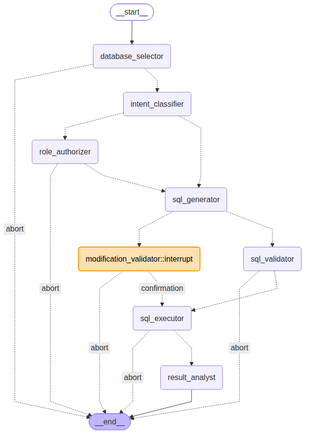

# sql-analyser-copilot

A LangGraph-based SQL Copilot that translates natural language questions into SQL queries, validates them for safety, executes them against SQLite databases, and analyzes the results. Built with FastAPI, Streamlit, and LangGraph.

## Architecture

The SQL Copilot uses a 9-node LangGraph workflow with conditional routing and interruption support:



### Nodes

1. **Database Selector** - Routes questions to the most relevant database
2. **Intent Classifier** - Determines if user request is a query or modification
3. **Role Authorizer** - Checks if user has permission for modification operations
4. **SQL Generator** - Converts natural language to SQL using LLM
5. **SQL Validator** - Ensures query safety for SELECT operations (no destructive operations)
6. **Modification Validator** - Manages interruption/confirmation workflow for modifications
7. **SQL Executor** - Runs the validated query against the database
8. **Result Analyst** - Analyzes results and generates insights

### Edge Routing

- **database_selector** → intent_classifier (abort if database selection fails)
- **intent_classifier** → role_authorizer (for modifications) or sql_generator (for queries)
- **role_authorizer** → sql_generator (authorized) or abort (unauthorized)
- **sql_generator** → sql_validator (queries) or modification_validator (modifications)
- **sql_validator** → sql_executor (valid) or abort (invalid)
- **modification_validator** → sql_executor (confirmed) or abort (cancelled)
- **sql_executor** → result_analyst (success) or abort (error)
- **result_analyst** → end

### Interruption Workflow

The **Modification Validator** node pauses execution and waits for user confirmation before executing modifications. This ensures users can review potentially destructive operations (INSERT/UPDATE/DELETE) before they run:

1. User makes a modification request
2. Intent classifier routes to modification path
3. Role authorizer checks permissions
4. SQL generator creates the modification query
5. **Modification validator interrupts** - waits for user confirmation
6. User reviews and confirms/cancels
7. If confirmed → SQL executor runs the query
8. If cancelled → graph aborts

This interruption mechanism is a key safety feature of the SQL Copilot.

## Authentication System

The application includes a user authentication system with role-based access control:

- **Roles**: `admin`, `editor`, `readonly`
- **Password hashing**: Argon2 via passlib
- **User management**: Admin-only CRUD operations

### Endpoints

| Endpoint | Method | Description | Role Required |
|----------|--------|-------------|---------------|
| `/auth/login` | POST | Authenticate user | Any |
| `/auth/me` | GET | Get current user info | Any |
| `/auth/users` | POST | Create user | admin |
| `/auth/users` | GET | List all users | admin |
| `/auth/users/{sub}` | PUT | Update user | admin |
| `/auth/users/{sub}` | DELETE | Delete user | admin |

## Run with an OpenAI model via LangChain

Install dependencies:

```bash
pip install -e .
```

Create your local environment file:

```bash
cp .env.example .env
```

Then set your provider settings in `.env`:

```bash
OPENAI_API_KEY="your_api_key_here"
SQL_COPILOT_MODEL="gpt-5.2"
```

Optional:

```bash
OPENAI_BASE_URL="https://your-provider.example/v1"
SQL_COPILOT_ANALYST_MODEL="gpt-5.2"
SQL_COPILOT_DATABASES='[
  {
    "name": "chinook",
    "path": "data/Chinook_Sqlite.sqlite",
    "description": "Music store database with artists, albums, tracks, customers, invoices, and employees."
  }
]'
```

`SQL_COPILOT_DATABASES` lets the app route a question to the most relevant database before generating SQL. If none of the configured databases match the question, or if the question could match more than one configured database, the app returns an error asking the user to reformulate the request more specifically.

Start the API:

```bash
make api
```

Try it:

```bash
curl http://127.0.0.1:8000/health
curl -X POST http://127.0.0.1:8000/query \
  -H "content-type: application/json" \
  -d '{"question":"Which 5 artists have the most albums?"}'
```

Start the Streamlit UI in a separate process:

```bash
make ui
```

### API Endpoints

| Endpoint | Method | Description |
|----------|--------|-------------|
| `/health` | GET | Health check |
| `/query` | POST | Execute SQL query (requires authentication) |

**Authentication**: Include the user's `sub` (subject ID) in the `x_user_sub` header.

Defaults:

- FastAPI API: `http://127.0.0.1:8000`
- Streamlit UI: `http://127.0.0.1:8501`

Optional UI configuration:

```bash
SQL_COPILOT_API_BASE_URL="http://127.0.0.1:8000"
```

Note: `langchain-openai` targets the official OpenAI API. A custom `OPENAI_BASE_URL` can work for compatible endpoints, but some third-party providers may require a provider-specific LangChain package.

## Continuous Integration

The CI pipeline (`.github/workflows/ci.yaml`) runs on every push to `main` and on all pull requests. It performs two jobs:

- **Python Tests**: Installs dependencies via `make install` and runs `make coverage` to execute tests with a coverage report.
- **Docker Build**: Builds the Docker image using `docker compose -f docker-compose.yml build`.

## Makefile Commands

A Makefile file has been created to easily control and use the repo. All of the following commands can be used. 

```bash
make env        # Create venv and install dependencies
make install    # Reinstall dependencies in existing venv
make test       # Run unit tests
make coverage   # Run tests with coverage report
make api        # Start FastAPI (port 8000)
make ui         # Start Streamlit UI (port 8501)
make docker-up  # Build and start Docker containers
make docker-down # Stop Docker containers
```

## Run with Docker

### Prerequisites

- [Docker](https://docs.docker.com/get-docker/) installed
- [Docker Compose](https://docs.docker.com/compose/install/) installed

### Configuration

Copy the environment file and set your API keys:

```bash
cp .env.example .env
# Edit .env with your OPENAI_API_KEY and other settings
```

### Quick start

```bash
make docker-up
```

Open the Streamlit UI at [http://localhost:8501](http://localhost:8501).

### Services

| Service | URL | Description |
|---------|-----|-------------|
| Frontend | http://localhost:8501 | Streamlit UI |
| Backend | http://localhost:8000 | FastAPI REST API |
| Health | http://localhost:8000/health | Health check endpoint |

### Updating database files

Database files are mounted from the host's `data/` directory at runtime. To use different databases, place SQLite files in `data/` and update `SQL_COPILOT_DATABASES` in your `.env` file.

### Stopping

```bash
make docker-down
```
